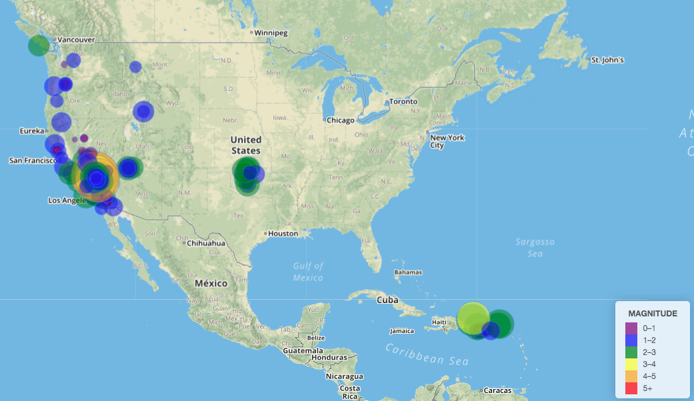

# Visualizing Data with Leaflet

## Background

The purpose of this project is to create a basic map using Leaflet that plots all of the earthquakes from USGS earthquake data set based on their longitude and latitude.

## Basic Visualization

## Data Set

   

   The USGS provides earthquake data in a number of different formats, updated every 5 minutes.  
   Visit the [USGS GeoJSON Feed](http://earthquake.usgs.gov/earthquakes/feed/v1.0/geojson.php) page and pick a data set to visualize. 
   When you click on a data set, for example 'All Earthquakes from the Past 7 Days', you will be given a JSON representation of that data. 
   You will be using the URL of this JSON to pull in the data for the visualization.

   

## Features

   * Data markers reflect the magnitude of the earthquake in their size and color.

   * Include popups that provide additional information about the earthquake when a marker is clicked.

   * A legend provides magnitude scale.

## Installation

Clone this repository to your local machine and double click on `index.html` file to see the visualization.